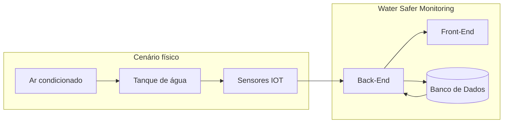

# **Water Safer Monitoring**

## Overview:

## Descrição:

`Projeto de Extensão - Ar condicionado` - Dashboard para análise e acompanhamento em tempo real do sistema integrando Front-End, Back-End e Banco de Dados

----

## Documentação:

0. [Wireframe](docs/wireframe.png)
1. [Padrões de Commits](docs/commit-patterns.md)  
2. [Gerenciamento de Branches](/docs/branch-management.md)
3. [Ferramentas e Dependências](/docs/tools-and-dependencies.md)
4. [Diagrama de Sequência](/docs/sequence-diagram.md)
5. Preparar o ambiente para rodar a aplicação:  
    1. [Ubuntu WSL Terminal (Recomendado)](/docs/application-environment/ubuntu.md)
    2. [Windows Terminal](/docs/application-environment/windows.md)