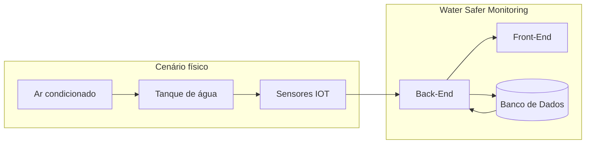

# **Water Safer Monitoring**

## Overview:

## Descrição:

`Projeto de Extensão - Ar condicionado` - Dashboard para análise e acompanhamento em tempo real do sistema integrando Front-End, Back-End e Banco de Dados