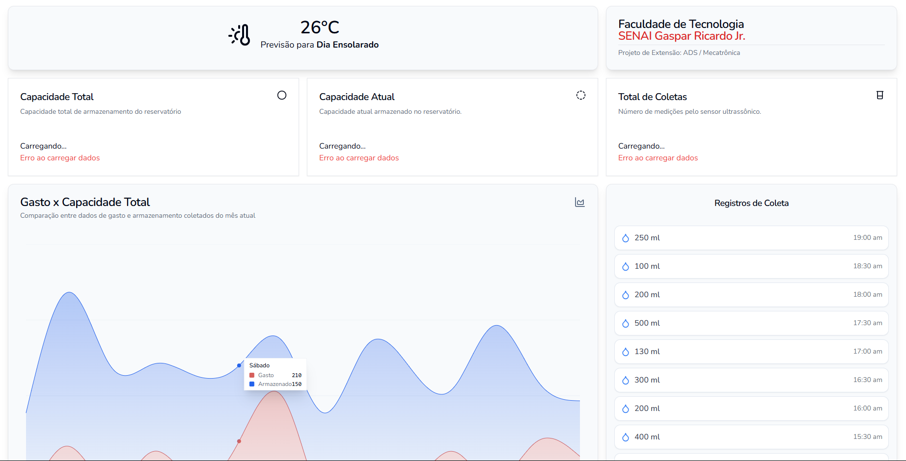
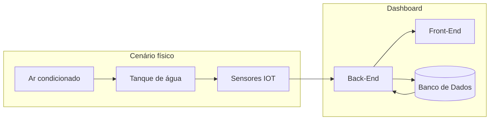

# 💧 **Aqua Air Monitoring**
### `Projeto de Extensão - Ar Condicionado`




## 🔍 Visão Geral


```mermaid
graph LR
    subgraph "Dashboard" 
        FE[Front-End]
        BE[Back-End]
        BD[(Banco de Dados)]
    end

    subgraph "Cenário físico"
        AC[Ar condicionado]
        TA[Tanque de água]
        SI[Sensores IOT]
    end

    AC --> TA
    TA --> SI

    SI --> BE
    BE --> BD

    BD --> BE

    BE --> FE
```

## 🌱 Descrição

Nosso projeto de extensão busca promover a sustentabilidade através do reaproveitamento da água condensada descartada por aparelhos de ar condicionado da faculdade.

Essa água, que normalmente seria desperdiçada, é redirecionada para tanques e utilizada na irrigação das plantas que sustentam o projeto de apicultura urbana (Projeto Abelha).

Com o auxílio de sensores IoT conectados a um ESP32, os dados (como nível de água, fluxo e uso) são coletados em tempo real e enviados para uma API, que os armazena em um banco de dados. A visualização é feita por meio de um painel (dashboard) intuitivo, permitindo o monitoramento remoto de todo o sistema.

## 🚀 Tecnologias

<div align="left">
  
  
  
  
  
  
  
  
  
  
  
  
  
</div>

## 📖 Documentação

1. [Wireframe](docs/wireframe.png)
2. [Anotações do Projeto](docs/project-notes/notes.png)
3. [Padrões de Commits](docs/commit-patterns.md)  
4. [Gerenciamento de Branches](/docs/branch-management.md)
5. [Ferramentas e Dependências](/docs/tools-and-dependencies.md)

## 🖥️ Primeira vez?

### ⚠️ **IMPORTANTE**
**Certifique-se de que todas as ferramentas e dependências necessárias estejam instaladas corretamente (ex: Git, Node.js, .NET SDK, etc.)**

### Clone o repositório:

```bash
git clone url_do_repositorio
```
Acesse o diretório do projeto:

```bash
cd watersafer-monitoring
```

## 📊 Frontend

Acesse a pasta do front-end:

```bash
cd frontend_arcondicionado
```

Instale as dependências:

```bash
npm install
```
Execute o servidor de desenvolvimento:

```bash
npm run dev
```

## ⚙️ Backend
Acesse a pasta da API:

```bash
cd WaterSaferAPI
```

Execute o projeto:

```bash
dotnet run
```